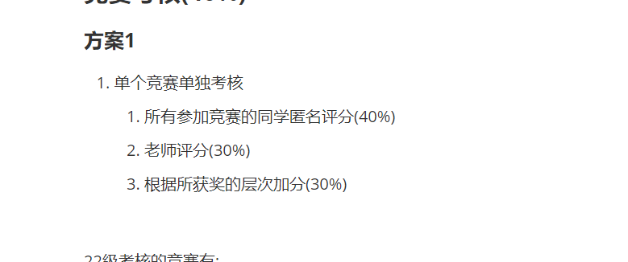

# 机器人实验室规章制度V2.0

## 实验室概况

机器人实验室旨在广纳对机器人和人工智能感兴趣的同学,为学院营造一个良好的学习和技术交流氛围,为学生就业和深造提供平台,我们欢迎相关专业的任何同学同我们进行交流,交流QQ群:

> 暂无

## 实验室能学到什么

1. 8051系列单片机 ARM系列单片机 FREERTOS操作系统
2. 嵌入式Linux系统
3. 电路设计 PCB布局布线
4. ROS(机器人操作系统)
5. 轮式机器人运动学控制
6. 各种控制算法 PID LQR等
7. 机器人建图和实时导航
8. 机器人路径规划
9. SSD YOLO 图像模型
10. OpenCV图像处理
11. 实验室会展开比赛的培训

...

## 基本规章制度

### 卫生打扫

实验室每周五将进行一次卫生打扫,每个同学需要清理好自己所在区域的工位和地面

其他公共区域需要一起打扫,打扫人员安排如下:

> 暂无

### 实验室整理

实验室每个月将进行一次元器件整理,需要将散乱的元器件和模块归好类,放在对应的收集框中,方便大家更好地查找元件

> [!IMPORTANT]
>
> ## 选拔

每年的九月份将进行宣传招新,选拔前6-7名加入到419,可以在419选一个自己的固定工位

每年新生大一可预招新培养，可作为种子选手在401进行学习，可根据其表现和任务安排进行选拔

对于淘汰的同学可以暂时加入到401学习,作为种子选手

### 23级选拔准备

预再招新3-4人，23级预期人数6人左右，待定

### 24级提前招新培养准备

预计于12月初初步检测24级学习情况，可招入401作为种子选手，待定

考核内容：

一. c语言应用（30%） 二. 51单片机应用 （70%）

### 参选学生基本要求

1. 品德优良,遵纪守法,身心健康
2. 相关专业本科大一和大二的在读学生
3. 对电子,机器人,人工智能等领域有了解,有责任心,能愿意花时间去学习相关的知识

### 基本得分项

1. 针对大二学生参加实验室招收的51单片机,C语言,C++考核加分,按照排名加分,最高不高于5分
1. 针对大一的同学参加大一下学期的实验室招新考核,按照排名得分,最高不高于5分

### 加分项

1. 作为大一学生参加暑假电控组的电子设计大赛获奖, 一等奖加5分,二等奖加3分,三等奖加2分
2. 自己有独立学习过或者做过实验室反向相关的项目或经历,提交材料后酌情加分,最高不高于5分
3. 有参加其他比赛获奖提交申请,根据比赛水平加分,最高不高于5分

## 考核

### 平时考勤(20%)

1. 每个月的25号开一次会,会上每个人需要总结上个月到本月的学习内容,并存档Github记录 (40%)
2. 请将自己的学习内容做好电子笔记,存档的时候转为PDF提交 (20%)
3. 平时来实验室的频率也将作为考勤参考 (40%)

### 比赛考勤(10%)

1. 比赛前期准备的贡献程度,由两部分组成  满10分
   1. 是对所在小组的贡献程度占30%,
   2. 对整个比赛的贡献程度占70%

2. 比赛现场的贡献程度,现场犯错会根据具体情况扣分 扣分最多不超过5分

### 竞赛考核(40%)

#### 方案1

1. 单个竞赛单独考核
   1. 所有参加竞赛的同学匿名评分(40%)
   2. 老师评分(30%)
   3. 根据所获奖的层次加分(30%)

22级考核的竞赛有:

	1. 算法精英大赛					(满分8分)
	2. 智能车						  (满分8分)
	3. 中国机器人及人工智能大赛	        (满分8分)
	4. 睿抗机器人开发者大赛            (满分8分)
	5. 电子设计大赛                   (满分8分)

#### 方案2

1. 根据获奖的层级水平有以下加分指标
   1. 电子设计大赛,智能车国一20分,国二15分,省一10分,省二7分,省三5分
   2. 实验室所参加的机器人比赛国一10分,国二7分,国三5分,省奖均为3分,同项目不累加
   3. 实验室外的比赛根据竞赛水平评定

### 贡献考核(30%)

贡献考核将由老师和学生共同打分,采取匿名不公开分数的打分方式,其中占比:

1. 学生自评平均分                     			60%
2. 老师评分                                     	 40%

## 淘汰

1. 每年的九月份将进行考核淘汰,大三年级预计将只保留5-6个名额
2. 淘汰的同学仍然可以参加实验室日常活动和竞赛
3. 淘汰的同学可以暂时加入到401学习,作为种子选手

## 参加比赛的原则

1. 实验室的比赛对学院公开,在报名之前会进行校内选拔,具体选拔方式依据比赛内容而定

2. 关于校内选拔请关注教务处通知

3. 有参加过类似比赛或者有类似项目经历的同学优先

4. 如果有出现违背道德,未得允许私自窃取他人劳动果实等违纪情况发生,将直接淘汰改队伍,

   同时将违纪的同学加入黑名单

5. 如有多支队伍将采取得分排名制,得分靠前的队伍将获得参赛资格

> [!IMPORTANT]
>
> ## 竞赛获得奖金分配方案

 1.在竞赛过程中全部方案和技术由队内人员做出：由队内人员根据贡献比例自行协商分配，或可抽取10%的佣金作为实验室发展资金。

 2.在竞赛过程中有借助他人的技术和方案：根据他人意愿抽取10%佣金作为他人技术支持报酬或作为实验室日常发展资金。

 3.在竞赛过程中有多组队伍共用一个框架：

方式一：获得的所有奖金统一收发，按附件一的计算方式进行打分，所有人员进行打分（不包含自评分），其过程匿名打分不公开分数，得出最后比例与其队内人员的内部评分对比，两者分数差距过大则由负责人根据其表现取权重分，根据每人分数进行发放，并根据框架提供者意愿抽取10%作为框架提供者的技术支持报酬或作为实验室发展资金。

方式二：

获得的所有奖金统一收发，按附件一的计算方式进行队内评分和队外评分，两者评分各占百分至五十，求和之后得到所有人的最后分配比例进行发放，并根据框架提供者意愿抽取10%作为框架提供者的技术支持报酬或作为实验室发展资金。

## 取得成果

> 自2023年秋学期22届学生记录至2024年秋学期：
>
> 共获a类竞赛国家级一等奖：8
>
> 共获a类竞赛国家级二等奖、三等奖若干
>
> 所有奖项于附件419实验室a类竞赛获奖汇总中记录

## 实验室人员信息

> 暂无

## 安全和注意事项

1. 人走断电, 先关空调后断电
2. 水杯原理插座
3. 航模锂电池充电请在专用充电仓内充电,需要有人照看
4. 航模锂电池单片电压在3.7V-4.2V,请注意充放电电压
5. 焊接时注意烙铁温度,焊接完成后注意断电(烙铁和插座都需要断电)

...

## 比赛注意事项(经验)

1. 现场的网络问题,远程连接还是HDMI连接
2. 现场场地环境影响
3. 机器人充电
4. USB端口连接
5. 启动终端检查
6. 代码异常处理
7. 代码备份和恢复
8. 多方案策略

...

